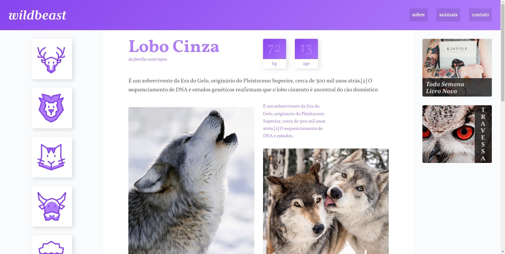

<h1 align="center"> Wildbeast </h1>

  

## Projeto

Projeto criado para praticar CSS Grid.

Para acessar o projeto, basta [clicar aqui]('https://danieldpalma.github.io/wildbeast/').

Projeto feito pelo curso da [Origamid](https://www.origamid.com/).

## Tecnologias

Para este projeto foram usadas as seguintes tecnologias:

- HTML
- CSS
